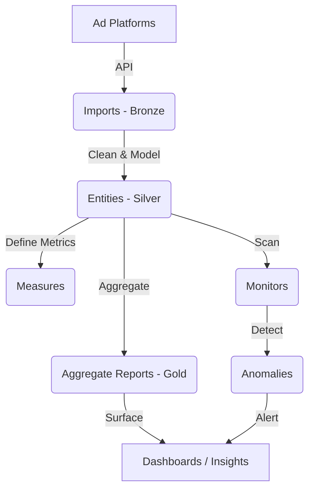

# Data Architecture & Business Concepts

This document outlines the core data concepts used in our system to surface business insights from advertising platforms like Google Ads and Meta Ads. It explains how raw data is transformed into actionable intelligence using a "Bronze -> Silver -> Gold" data lakehouse architecture.

## High-Level Data Flow

---

## 1. Imports (Data Sources)
**Technical Level:** Bronze  
**Purpose:** Raw Data Ingestion & Fidelity

An **Import** represents the direct connection to an external advertising platform's API (e.g., Google Ads, Facebook Ads). It defines exactly what raw data we pull into the system.

- **What it is:** A raw, immutable dump of performance data. We perform minimal transformation here to ensure we have an exact copy of what the platform reported.
- **Example:** `googleAdsCampaignPerformance` pulls raw `spend`, `clicks`, and `impressions` for every campaign, exactly as Google delivers it.
- **Business Value:** 
    - **Auditability:** If a number looks wrong downstream, we can always trace it back to this raw source to prove it's what the platform sent.
    - **Recovery:** If we change our business logic (Entities), we can "replay" this raw data without needing to re-fetch from the API.

## 2. Entities (Business Data Tables)
**Technical Level:** Silver  
**Purpose:** Standardization, Modeling & Grain Definition

An **Entity** is the clean, usable version of the data. While Imports are raw and potentially messy (e.g., different platforms use different column names), Entities apply business rules to make the data consistent.

- **What it is:** A structured table that combines or cleans raw data. It defines the **"grain"** of the data—what one row represents (e.g., "Daily data per Keyword" or "Daily data per Campaign").
- **Key Function - Standardization:** It maps platform-specific terms to our internal standard (e.g., mapping Google's `cost` and Facebook's `spend_amount` to a unified `spend` column).
- **Example:** `CampaignDaily` is a silver table containing daily performance metrics for all campaigns, regardless of source, with consistent column names.
- **Business Value:** Provides a **"Single Source of Truth."** All downstream reports and monitors read from Entities, ensuring that "Spend" is calculated effectively the same way for everyone.

## 3. Measures (Metric Definitions)
**Purpose:** Semantic Consistency

A **Measure** is a specific, reusable definition of a business metric tied to an Entity. It ensures that when we talk about "Spend," "ROAS" (Return on Ad Spend), or "CPA" (Cost Per Acquisition), we are calculating it exactly the same way across the entire application.

- **What it is:** A reusable formula definition.
- **Example:** `campaignSpendMeasure` defines "Spend" as `SUM(spend)` from the `CampaignDaily` entity.
- **Business Value:** Prevents "Metric Drift," where different reports might calculate the same metric differently (e.g., one report including tax and another excluding it).

## 4. Monitors & Anomalies (Automated Monitoring)
**Purpose:** Proactive Alerts & Safety Nets

A **Monitor** is an automated system that continually scans an Entity (via a Measure) to detect problems, opportunities, or interesting patterns. When a Monitor triggers, it records an **Anomaly**.

### Monitor Strategies (How we detect)
We use different strategies depending on the nature of the problem:

1.  **Threshold (Absolute Limit):** Checks if a metric crosses a hard line.
    *   *Example:* `WastedSpendMonitor` triggers if `spend > $100` AND `conversions = 0`.
2.  **Relative Delta (Change over Time):** Checks for sudden drops or spikes compared to a previous period.
    *   *Example:* "Conversion Drop Monitor" triggers if conversions drop by 50% week-over-week.
3.  **Z-Score (Statistical Deviation):** Uses statistics to find "weird" behavior that doesn't fit the historical pattern.
    *   *Example:* `AccountSpendAnomaly` learns the normal daily spend range for an account and alerts if a day is 3 standard deviations away (e.g., a sudden 500% spike).

- **Anomaly:** The specific event recorded when a Monitor fires. It contains the context (Account, Campaign, Date) and the severity of the issue.
- **Business Value:** Catches expensive mistakes (like runaway budgets or broken tracking) immediately, often before a human would notice them on a dashboard.

## 5. Aggregate Reports (Strategic Insights)
**Technical Level:** Gold  
**Purpose:** High-Level Analysis & Storytelling

An **Aggregate Report** is a specialized, summarized view of data designed to answer a specific strategic question. Unlike Entities (which are granular daily logs), Reports aggregate data over time (e.g., "Last 90 Days") to show trends and high-level performance.

- **Types of Reports:**
    *   **Deterministic:** Shows factual totals (e.g., "Total Spend by Channel").
    *   **Heuristic:** Applies logic to categorize data (e.g., "Wasted Spend" report showing keywords that have spent money with zero return).
- **Example:** `GoogleSpendBreakdown` groups all campaign data by `category` (Search, Shopping, YouTube) to show the budget distribution.
- **Business Value:** Delivers ready-to-use insights. Instead of asking a user to analyze 10,000 rows of daily data, we present a single card saying "Shopping campaigns are driving 80% of revenue, but Search is inefficient."

---

## Summary of the "Why"

| Concept | Answers the Question... |
| :--- | :--- |
| **Import** | "What exactly did the API send us?" |
| **Entity** | "What does our clean, standardized data look like?" |
| **Measure** | "How exactly do we define 'ROAS' or 'Spend'?" |
| **Monitor** | "Is anything broken or weird right now?" |
| **Report** | "What is the high-level trend or answer to my business question?" |
